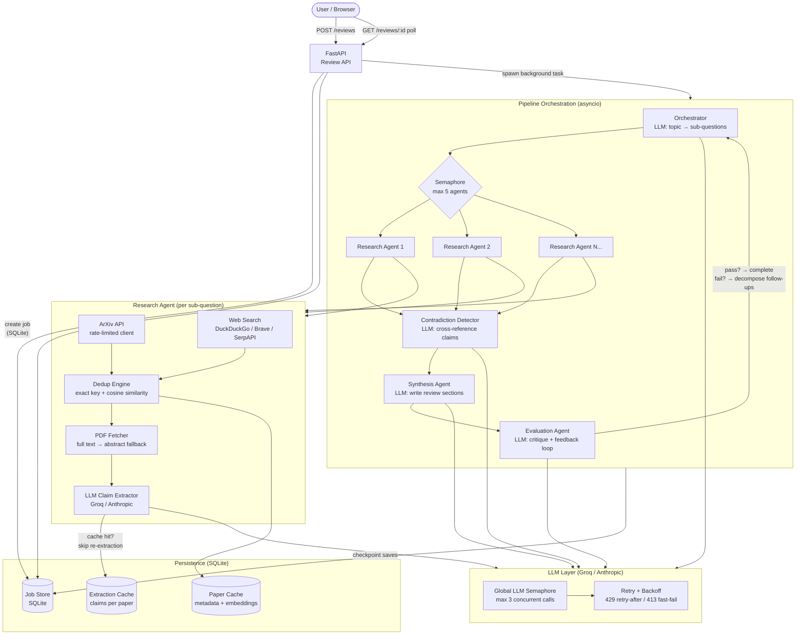
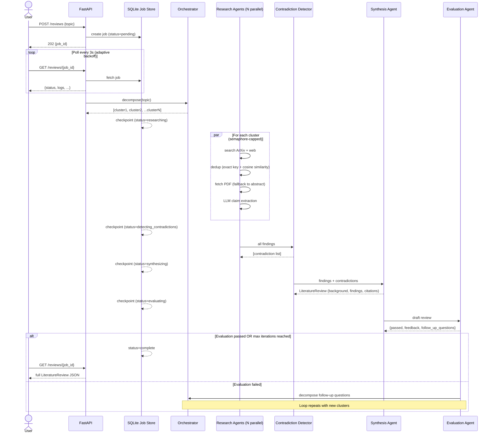

# LitReviewAI — Academic Literature Review Agent

> Give it a research topic. Get back a structured literature review with citations — automatically.

LitReviewAI is an autonomous multi-agent system that decomposes a research question into sub-questions, runs concurrent search agents against ArXiv and the web, extracts structured claims from full-text PDFs using an LLM, detects genuine contradictions between papers, and synthesises a structured review with a deterministic citation list.

---

## Architecture



---

## Data Flow



---

## Tech Stack

| Layer | Technology | Why |
|---|---|---|
| **API** | FastAPI + Starlette | Async-native, automatic OpenAPI docs, lifespan management |
| **LLM** | Groq (LLaMA 3.3 70B) / Anthropic Claude | Pluggable via `LLMClient` — swap provider in `.env` |
| **Concurrency** | `asyncio.gather` + `asyncio.Semaphore` | Fine-grained control over parallelism without threads |
| **Search** | ArXiv Atom API + pluggable web search | `WebSearchProvider` ABC — DuckDuckGo, Brave, SerpAPI |
| **Embeddings** | `sentence-transformers` (local) | Semantic dedup without an external embedding API |
| **Persistence** | SQLite (two separate DBs) | Paper/extraction cache + job state, zero infrastructure |
| **Frontend** | Vanilla JS + CSS | No framework dependency, adaptive polling with exponential back-off |
| **Rate limiting** | Custom Starlette middleware | Read/write bucket separation — GET polls never consume POST budget |

---

## Key Engineering Decisions

### 1. Semaphore-capped concurrency, not unbounded fan-out
With 5 clusters × 4 sub-questions × 8 papers, a naïve `asyncio.gather` would fire 160 LLM calls simultaneously — guaranteed to exhaust any API quota in seconds. Instead, two semaphores gate the system:
- `_agent_semaphore` — max 5 research agents running concurrently (pipeline level)
- `_llm_semaphore` — max 3 LLM calls in-flight (global, across all agents)

This keeps Groq usage well within 30 RPM while maximising throughput.

### 2. Two-stage deduplication
The same paper can surface via ArXiv search AND a web result with a different title. Stage 1 is a `dict`-based exact paper-key dedup (O(1), catches 95% of cases). Stage 2 is cosine-similarity comparison of title+abstract embeddings — catches mirrors, reposts, and preprint/published version pairs. Papers already seen in any prior pipeline job are excluded before embedding is even computed.

### 3. Deterministic citation assembly
The LLM writes narrative prose — it does not assemble the reference list. `SynthesisAgent._collect_references` builds citations directly from the structured extraction output, sorted by year and title. This means citations are guaranteed to match what was actually fetched, eliminating the hallucinated reference problem common in LLM-generated reviews.

### 4. Evaluation-feedback loop
The pipeline doesn't stop at first synthesis. An `EvaluationAgent` critiques the draft and can reject it with specific feedback (e.g., "missing clinical trial evidence"). The pipeline then decomposes follow-up questions from that feedback and runs targeted research rounds — up to `MAX_FEEDBACK_LOOP_ITERATIONS` times.

### 5. Failure isolation at every layer
- A PDF that 403s, times out, or is too large → falls back to abstract, `failure_reason` recorded
- An LLM extraction that fails → `extraction_failed=True`, paper skipped in synthesis
- A web search that exhausts retries → ArXiv results still used
- A single sub-question failure → other sub-questions complete normally

No single failure cascades to a job failure.

### 6. SQLite-backed job persistence with checkpoints
Jobs are checkpointed to SQLite after each pipeline phase (decompose → research → contradiction → synthesis). A server restart does not lose job state — the last checkpoint is always readable. The task itself doesn't survive a restart (it runs in the FastAPI process), but the data does.

---

## Project Layout

```
app/
├── main.py                     FastAPI entry point: submit + poll jobs
├── container.py                Composition root — single place wiring all dependencies
├── config.py                   Pydantic-settings: all config from environment
├── core/
│   ├── orchestrator.py         Topic decomposition → research clusters
│   ├── research_agent.py       Search + dedup + fetch + LLM extraction (per sub-question)
│   ├── contradiction_detector.py  Cross-references claims, flags genuine disagreements
│   ├── synthesis.py            Writes final review; builds citation list deterministically
│   ├── evaluation.py           Critiques draft; drives feedback loop
│   ├── pipeline.py             Orchestrates all stages into one job run
│   └── prompts.py              All LLM system prompts — versioned with the code
├── services/
│   ├── llm_client.py           LLM wrapper: retry/backoff, 429 handling, 413 fast-fail
│   ├── arxiv_client.py         ArXiv Atom API client with process-wide rate limiting
│   ├── web_search_client.py    Pluggable web search (DuckDuckGo / Brave / SerpAPI)
│   ├── pdf_fetcher.py          PDF download + text extraction, fails soft
│   └── embeddings.py           Local sentence-transformer embeddings for semantic dedup
├── db/
│   ├── memory_store.py         SQLite: paper metadata + extraction cache (cross-job)
│   └── job_store.py            SQLite: job state with TTL eviction + checkpoint saves
└── utils/
    ├── rate_limit_middleware.py Per-IP sliding-window limiter (write-only bucket)
    ├── resilience.py           Retry/backoff primitives + async rate limiter
    └── logging_config.py       Structured JSON logging

tests/                          Unit + benchmark tests (network-free)
smoke_test.py                   Full pipeline run with all externals mocked
```

---

## Quick Start

```bash
git clone https://github.com/yourname/lit-review-agent
cd lit-review-agent
cp .env.example .env
# Set GROQ_API_KEY (or ANTHROPIC_API_KEY) in .env

pip install -r requirements.txt
uvicorn app.main:app --reload
# Open http://localhost:8000
```

### API

```bash
# Submit a review (returns immediately with a job id)
curl -X POST http://localhost:8000/reviews \
  -H "Content-Type: application/json" \
  -d '{"topic": "machine learning approaches for Alzheimer disease detection"}'
# → {"job_id": "a1b2c3d4e5f6", "status": "pending", "created_at": "..."}

# Poll until complete (status: pending → decomposing → researching → synthesizing → complete)
curl http://localhost:8000/reviews/a1b2c3d4e5f6
```

---

## Scaling

This ships as a single process — the right amount of infrastructure for on-demand use.

| Bottleneck | Current | Production path |
|---|---|---|
| Job storage | SQLite (in-process) | Swap `JobStore` for Redis — same interface, zero other changes |
| Task execution | FastAPI `BackgroundTasks` | Move to Celery/ARQ so tasks survive restarts and scale horizontally |
| Paper/embedding store | SQLite | Swap `MemoryStore` for Postgres + pgvector for multi-process sharing |
| LLM provider | Groq free tier (30 RPM) | Switch `LLM_PROVIDER=anthropic` in `.env`, or add any OpenAI-compatible endpoint |

---

## Testing

```bash
# Unit tests (network-free: JSON parsing, retry logic, dedup, contradiction filtering)
pytest

# Persistence benchmark: proves job survival across simulated process restarts
pytest tests/test_job_persistence.py -v -s

# Rate-limit correctness: proves GET polling never consumes POST rate-limit budget
pytest tests/test_rate_limit_correctness.py -v -s
```
